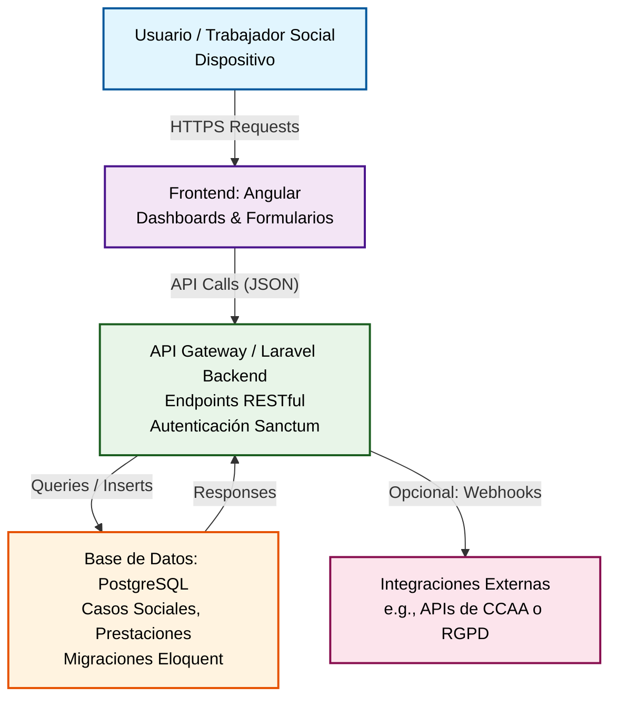
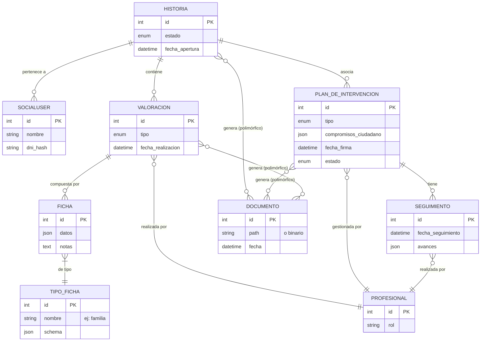

# Arquitectura de VIDA

## Introducción

La arquitectura de **VIDA: Visión Integral de Derechos y Atención Social** sigue un modelo cliente-servidor modular, diseñado para garantizar escalabilidad, seguridad y facilidad de mantenimiento en el contexto de la gestión de servicios sociales. El backend, basado en Laravel, actúa como núcleo central manejando la lógica de negocio sensible (como valoraciones de casos y prestaciones), mientras que la base de datos PostgreSQL asegura el almacenamiento robusto y compliant con normativas como RGPD. El frontend en Angular (en fase de desarrollo) proporcionará interfaces intuitivas para trabajadores sociales, fomentando una interacción proactiva y centrada en el usuario. Esta estructura permite integraciones futuras con sistemas externos (e.g., APIs autonómicas) y soporta despliegues en entornos cloud o locales. A continuación, se presenta un diagrama de alto nivel que ilustra las componentes clave y sus interacciones.

# Documentación del Modelo de Datos para VIDA: Visión Integral de Derechos y Atención Social

## Introducción

Este documento describe el modelo de datos central del proyecto VIDA, diseñado para gestionar de forma eficiente y segura las intervenciones sociales en el contexto de los Servicios Sociales del Ayuntamiento de Madrid. El modelo se inspira en el **Plan Estratégico de Servicios Sociales 2023-2027** (que enfatiza la personalización de planes operativos y el seguimiento para promover la autonomía, págs. 37-46 y 59) y la **Guía de Prestaciones de Servicios Sociales y Educativos 2024** (que agrupa 112 prestaciones en áreas como familia, vivienda y economía, con un enfoque en simplificar el acceso y reducir la burocracia, págs. 2-3).

El núcleo del modelo es la entidad **Historia** (anteriormente "Caso"), que representa el hilo completo de una intervención individualizada para un beneficiario o familia. Este se relaciona con **Valoraciones** (iniciales y sucesivas), **Fichas** (detalladas por tipo, como familiar o económica), **Planes de Intervención** (PISO, simples o especializados) y **Seguimientos** (periódicos para revisión). 

El diseño es relacional, optimizado para PostgreSQL y Laravel (con Eloquent ORM para relaciones), priorizando escalabilidad (para decenas de entidades), seguridad (encriptación de datos sensibles per GDPR y Decreto 51/2023) y flexibilidad (para integrar IA en fichas o generación de PDFs). Se usan tablas auxiliares (ej: tipos de fichas) para lookups eficientes y polimorfismos para derivaciones especializadas.

## Entidades Principales y Relaciones

A continuación, se detalla cada entidad clave, sus atributos principales (sugeridos para el esquema) y relaciones. Las relaciones siguen convenciones Eloquent (hasMany, belongsTo, etc.), con foreign keys indexadas para rendimiento. Se incluyen mejoras para compliance y usabilidad, como estados enum y campos auditables.

| Entidad Principal | Atributos Clave | Relaciones Clave | Notas/Mejoras Sugeridas |
|-------------------|-----------------|------------------|-------------------------|
| **Historia** (raíz del ciclo de intervención: apertura de un nuevo acceso a servicios) | - id (PK) - beneficiario_id (FK a Beneficiario) - estado (enum: 'abierto', 'seguimiento', 'alta') - fecha_apertura - centro_servicios_id (FK) - created_at, updated_at | - hasMany: Valoraciones - hasMany: PlanesDeIntervencion (o morphMany para especializados) - morphMany: Documentos (polimórfico para PDFs como PISO) - belongsTo: Beneficiario (entidad auxiliar para persona/familia) | - Centraliza el lifecycle (alineado con "atención centrada en la persona", Guía pág. 3). - Auto-pull de datos iniciales del Registro Único de Usuarios (Plan pág. 9). - Campo JSON para metadatos (ej: distritos de Madrid). |
| **Valoracion** (evaluación inicial o de seguimiento, compuesta por fichas detalladas) | - id (PK) - historia_id (FK) - trabajador_social_id (FK) - fecha_realizacion - tipo (enum: 'inicial', 'sucesiva') - resumen (texto, opcional para IA) - created_at, updated_at | - belongsTo: Historia - hasMany: Fichas - belongsTo: TipoFicha (tabla auxiliar: id, nombre ej: 'familia', descripcion, schema JSON para campos) - belongsTo: TrabajadorSocial | - Permite evoluciones temporales (Plan pág. 59: seguimiento y evaluación). - Campo JSON `resumen_ia` para extracciones futuras de texto libre. - Validaciones por ficha para completitud (ej: campos obligatorios HSU). |
| **Ficha** (módulos granulares de la valoración, por área vital) | - id (PK) - valoracion_id (FK) - tipo_ficha_id (FK) - datos (JSON para campos dinámicos: ej: {ingresos: 800, hijos: 2}) - notas (texto libre) - created_at, updated_at | - belongsTo: Valoracion - belongsTo: TipoFicha - morphMany: Campos (opcional, si subcampos dinámicos por tipo) | - Tabla auxiliar **tipos_fichas** con schema JSON para guiado UX (ej: campos obligatorios por 'económica'). - Soft deletes para revisiones históricas. - Integra con wizards modulares para simplificar rellenado (evita tedio en áreas como vivienda). |
| **PlanDeIntervencion** (PISO: documento formal con prestaciones y compromisos) | - id (PK) - historia_id (FK) - tipo (enum: 'general', 'especializado' ej: familia) - compromisos_ciudadano (JSON array: ej: ['curso FP']) - prestaciones (JSON o many-to-many con tabla Prestaciones) - fecha_firma - estado (enum: 'activo', 'pausado', 'cerrado') - created_at, updated_at | - belongsTo: Historia (o morphTo para subtipos especializados) - hasMany: Seguimientos - belongsTo: Valoracion (última como base) - morphMany: Documentos (para PDF generado) | - Captura bidireccionalidad (prestaciones de Guía + compromisos, Plan pág. 35: promoción de capacidades). - Relación con 112 prestaciones de Guía via pivot (compromisos recíprocos). - Soporte para derivaciones (ej: plan específico para género). |
| **Seguimiento** (revisiones periódicas del plan, con mini-evaluaciones) | - id (PK) - plan_id (FK) - trabajador_social_id (FK) - fecha_seguimiento - notas_evolucion (texto, con opción IA) - avances (JSON: progreso en compromisos) - created_at, updated_at | - belongsTo: PlanDeIntervencion - belongsTo: TrabajadorSocial - hasOne: Valoracion (opcional, para fichas de revisión) | - Cronológico para trazabilidad (Plan pág. 3: prevención de enquistamiento). - Campo `alertas` (JSON) para gaps detectados (ej: no avances en ingresos). - Relación inversa a Alta (entidad separada para cierre, con motivos). |

### Notas generales sobre el modelo
- **Entidades auxiliares**: Incluye **Beneficiario** (id, nombre, dni_hash para privacidad, direccion via Base de Datos Ciudad), **TrabajadorSocial** (id, rol) y **Prestacion** (de Guía: id, tipo, descripcion) para completitud.
- **Seguridad y compliance**: Todos los campos sensibles (ej: datos en Fichas) encriptados (pgcrypto en PostgreSQL). Auditoría via timestamps y `created_by`. Retención automática post-alta (6 meses, per protocolo ético).
- **Escalabilidad**: ~7 tablas principales; usa índices en FKs para queries como "seguimientos pendientes por Historia". Para casos especiales (sin hogar, menores), subtipos via `tipo` enum o herencia polimórfica.
- **Integraciones**: Soporte para IA (ej: estructuración de notas en Fichas), generación de PDFs (via DomPDF, como discutido) y flujos guiados (wizards en frontend).

## Diagrama ER (Entity-Relationship)

A continuación, un diagrama ER conceptual en formato Mermaid (renderizable en GitHub o tools como Mermaid Live). Representa entidades como rectángulos, relaciones como líneas con cardinalidad (1:1, 1:N, N:N), y atributos clave en óvalos. Enfocado en la intervención; otras entidades como SocialUser se muestran simplificadas.

Este diagrama ilustra el flujo jerárquico: una Historia ramifica en Valoraciones/Fichas para diagnóstico, y Planes/Seguimientos para acción y revisión. 
