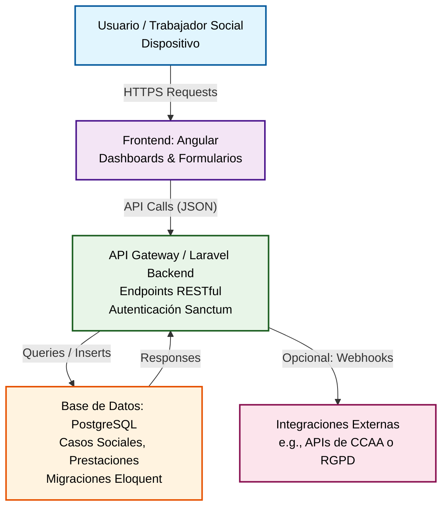

# Arquitectura de VIDA

## Introducción

La arquitectura de **VIDA: Visión Integral de Derechos y Atención Social** sigue un modelo cliente-servidor modular, diseñado para garantizar escalabilidad, seguridad y facilidad de mantenimiento en el contexto de la gestión de servicios sociales. El backend, basado en Laravel, actúa como núcleo central manejando la lógica de negocio sensible (como valoraciones de casos y prestaciones), mientras que la base de datos PostgreSQL asegura el almacenamiento robusto y compliant con normativas como RGPD. El frontend en Angular (en fase de desarrollo) proporcionará interfaces intuitivas para trabajadores sociales, fomentando una interacción proactiva y centrada en el usuario. Esta estructura permite integraciones futuras con sistemas externos (e.g., APIs autonómicas) y soporta despliegues en entornos cloud o locales. A continuación, se presenta un diagrama de alto nivel que ilustra las componentes clave y sus interacciones.

