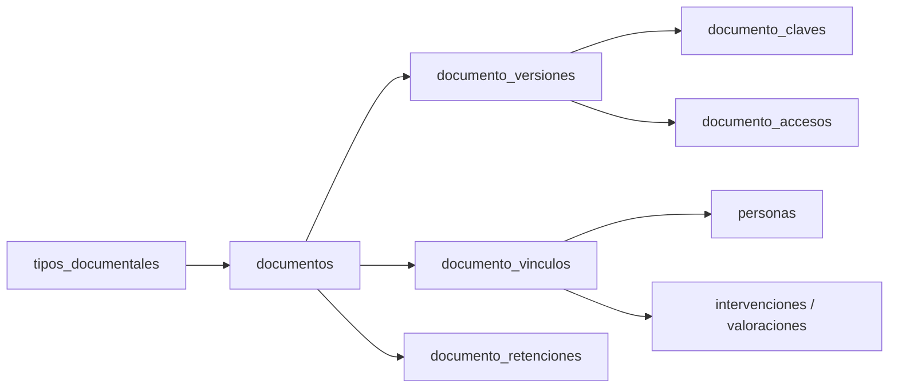
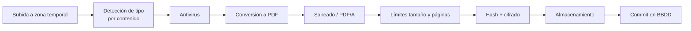
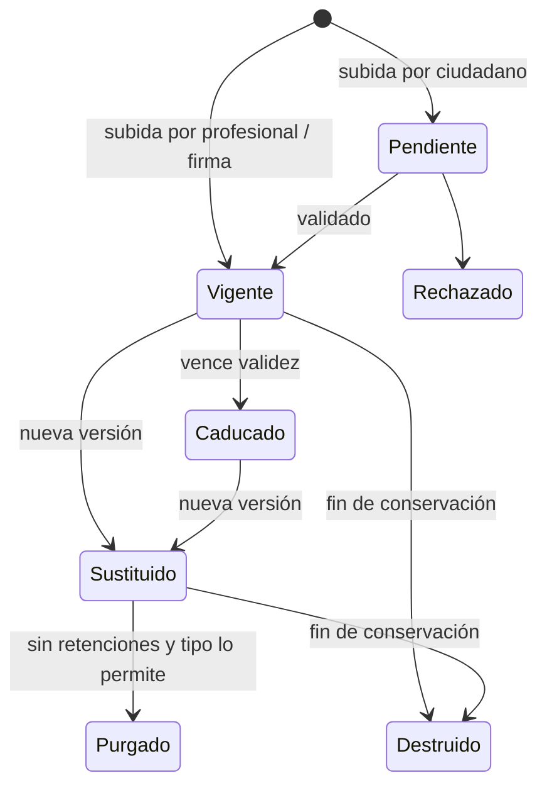

# VIDA · Análisis de gestión de documentos

Borrador 1 · Sep 24, 2026 · @Borja

## Alcance y principios

VIDA guarda y asocia documentos a personas e intervenciones, pero no es un gestor de expedientes administrativos. Si en el futuro se integra con uno, la interacción con el profesional será la vía natural de entrada de documentos al expediente.

Principios de diseño:

- **La BBDD manda, el fichero es tonto.** Toda la información sobre qué es un documento, a quién pertenece, dónde está y cómo se recupera vive en PostgreSQL. El fichero es un blob opaco.
- **Almacenamiento desacoplado.** El usuario dice "guarda este documento de este ciudadano"; dónde y cómo se guarda es transparente. Cambiar de tecnología o proveedor no afecta a usuarios ni a la lógica de negocio.
- **Búsqueda por metadatos, nunca por contenido.** No se indexa el texto de los documentos, lo que además reduce la superficie de exposición.
- **Un acceso al almacenamiento no revela nada.** Sin la BBDD y las claves, los ficheros no se pueden leer ni asociar a una persona.
- **Formato de almacenamiento único: PDF.** Se aceptan otros formatos en la entrada, pero se normalizan.
- **Nada se pierde sin decisión explícita.** Dar de baja no es destruir; la destrucción es un proceso con aprobación y constancia.
- **Preparado para salir.** Aunque hoy no se remiten documentos a otras administraciones, el modelo no debe impedirlo.

## Tipos de documento

Hay tres familias. Solo las dos últimas generan ficheros.

| Familia | Dónde vive | Origen (ENI) | Fichero |
| --- | --- | --- | --- |
| Modelos de informe | Filament, como configuración versionada | — | No |
| Informes elaborados por profesionales | Borrador en BBDD; al firmarse, PDF firmado (PAdES) | Administración | Sí, inmutable tras la firma |
| Documentación aportada por el ciudadano | Almacenamiento de documentos | Ciudadano | Sí, normalizado a PDF |

- **Informes.** El borrador no genera fichero: es contenido estructurado en BBDD. Al firmar se genera el PDF, se firma y se almacena. Nunca se regenera. Se guarda referencia al modelo y a la versión del modelo usados.
- **Documentación del ciudadano.** La sube hoy un profesional (presencial, escaneo) y en el futuro también el propio ciudadano desde un portal. Se registra quién la recibe, cuándo y por qué canal.

## Gestor de tipos documentales (Filament)

Cada documento pertenece a un tipo documental, configurable en el panel de administración con la misma filosofía que las valoraciones. El tipo fija el comportamiento por defecto; algunos atributos se pueden sobrescribir por documento.

| Atributo | Ejemplo | Sobrescribible por documento |
| --- | --- | --- |
| Nombre y código | Certificado de empadronamiento | No |
| Familia | Aportado por el ciudadano / informe | No |
| Origen ENI | Ciudadano / Administración | No |
| Caduca y validez por defecto | Sí, 3 meses | Sí (fecha de validez) |
| Política de versiones anteriores | Conservar / purgar si no está retenida | No |
| Plazo de conservación | Según calendario del archivo | No |
| Visible para el ciudadano | No | Sí |
| Firma requerida | Sí para informes | No |
| Límites de tamaño y páginas | 20 MB, 50 páginas | No |
| Metadatos adicionales exigidos | Fecha de emisión, órgano emisor | No |
| Entidades a las que se puede vincular | Persona, intervención, valoración | No |

Los modelos de informe se gestionan en el mismo panel y están versionados: un informe firmado apunta a la versión exacta del modelo con que se elaboró.

## Modelo de datos

El documento es una entidad lógica con una o más versiones; cada versión tiene su fichero. Se vincula n:M a personas y otras entidades.

| Tabla | Contenido principal |
| --- | --- |
| `tipos_documentales` | Configuración por tipo (sección anterior) |
| `documentos` | ID estable, tipo, fecha de emisión, fecha de validez, origen, visible para el ciudadano, estado |
| `documento_versiones` | Nº de versión, clave de almacenamiento opaca (UUID), hash SHA-256, tamaño, páginas, MIME, nombre original, quién la subió, canal, fecha de captura, modelo y versión de modelo (informes), estado (vigente / sustituida / purgada / destruida) |
| `documento_vinculos` | Documento ↔ entidad (persona, intervención, valoración), fecha de alta y baja del vínculo, quién lo creó |
| `documento_retenciones` | Motivo (intervención cerrada; en el futuro remisión, requerimiento judicial…), entidad que retiene, desde, hasta |
| `documento_claves` | Clave de cifrado de cada versión, cifrada con la clave maestra (fuera de la BBDD principal si es posible) |
| `documento_accesos` | Quién, cuándo, qué versión, qué acción (ver, descargar), desde dónde |
| `actas_eliminacion` | Qué se destruyó (metadatos, no contenido), motivo, quién aprobó, cuándo |

Decisiones:

- **Vínculos n:M.** Un libro de familia o un certificado de convivencia se sube una vez y se vincula a todos los miembros de la unidad de convivencia. Al sustituirlo o al caducar, cambia para todos. Se vincula a personas, no a la unidad de convivencia, porque esta cambia con el tiempo.
- **Siempre por ID interno de persona.** DNI, NIE o pasaporte son metadatos historizados de la persona, no la clave del vínculo.
- **Las retenciones son genéricas.** "Anclado" es tener al menos una retención activa. La futura remisión a otra administración será un tipo más de retención.

## Gestor de ficheros

Un servicio interno único recibe, valida, normaliza, cifra y almacena. Ningún otro componente toca el almacenamiento directamente.

**Almacenamiento agnóstico.** Se usa la abstracción de discos de Laravel (Flysystem): local, NAS, S3 o equivalente se eligen por configuración. El servicio solo conoce claves opacas; ni rutas ni nombres contienen datos personales.

**Tubería de entrada:**

Si falla cualquier paso, no queda nada almacenado. Un job periódico limpia huérfanos en ambos sentidos (fichero sin registro, registro sin fichero).

**Formatos:**

| Entrada | Tratamiento |
| --- | --- |
| PDF | Se sanea y se normaliza a PDF/A: sin JavaScript, ficheros incrustados ni acciones. Se rechazan los cifrados con contraseña |
| JPG, PNG, HEIC (fotos, escaneos) | Se convierten a PDF en el servidor |
| ODT, DOCX | Se convierten a PDF (LibreOffice headless). Se rechazan con macros |
| ZIP y otros contenedores, ejecutables, scripts, formatos con macros | Rechazo |

El tipo se detecta por contenido (magic bytes), nunca por extensión. La conversión la hace el sistema, no el usuario: se guarda solo el PDF resultante.

El fichero original se destruye tras una conversión correcta y no se conserva en ningún almacenamiento, ni siquiera temporal más allá del proceso de entrada.

**Límites.** Por defecto 20 MB y 50 páginas, configurables por tipo documental. Si un escaneo pesa demasiado para su número de páginas, se intenta recomprimir antes de rechazarlo; si tiene demasiadas páginas, se rechaza, porque indica un problema de proceso.

## Arquitectura de seguridad

Objetivo: quien acceda solo al almacenamiento no puede leer los ficheros ni saber a quién pertenecen.

- **Cifrado por versión de documento (envelope encryption).** Cada fichero se cifra con su propia clave. Esa clave se guarda cifrada con una clave maestra custodiada en un KMS o Vault.
- **Separación de tres piezas.** Ficheros, BBDD y clave maestra viven en sitios distintos. Comprometer uno solo no da acceso al contenido.
- **Claves de almacenamiento opacas.** UUID sin datos personales. El nombre original del fichero se guarda como metadato en BBDD.
- **Sin URLs directas.** Toda descarga pasa por la aplicación, con autorización por documento. Si el proveedor lo exige, se usan URLs firmadas de pocos minutos.
- **Registro de accesos.** Cada visualización y descarga queda registrada (quién, cuándo, qué versión).
- **Crypto-shredding.** Destruir un documento es destruir su clave. El fichero puede seguir en backups o réplicas, pero es irrecuperable.
- **Integridad.** El hash SHA-256 permite verificar en cualquier momento que el fichero no ha cambiado; se puede programar una verificación periódica.

Nivel de referencia: ENS, categoría a confirmar (previsiblemente media o alta por tratar datos de servicios sociales).

## Ciclo de vida

Todos los documentos se versionan. Lo único que varía por tipo documental es si las versiones anteriores no retenidas pueden purgarse.

- **Alta.** Tras pasar la tubería de entrada se crea el registro con sus metadatos y vínculos. Lo subido por el ciudadano (futuro portal) queda pendiente de validación por un profesional.
- **Caducidad.** Si el tipo caduca, la fecha de validez permite avisar de documentación caducada en valoraciones e intervenciones. El documento caducado no se borra.
- **Sustitución.** Una nueva versión pasa a ser la vigente para todas las personas vinculadas. La anterior queda como sustituida.
- **Versiones anteriores.** Se conservan siempre si el tipo lo exige (p. ej. informes médicos de dependencia o discapacidad) o si tienen alguna retención. Si no, y el tipo lo permite (p. ej. DNI renovado sin más cambios), se purgan.
- **Retenciones.** Mientras un documento tenga una retención activa (intervención cerrada que lo usó; en el futuro, remisión), no se purga ni se destruye.
- **Baja de persona o intervención.** Es una baja lógica: desactiva vínculos, no borra ficheros.
- **Destrucción.** Al vencer el plazo de conservación y sin retenciones, un proceso propone la eliminación. Un responsable la aprueba, se destruyen las claves (crypto-shredding) y se levanta acta con los metadatos.

## Previsión de futuro

Nada de esto se desarrolla ahora. El modelo debe permitirlo sin rediseño.

- **Salida a otras administraciones.** Caso previsto: prestaciones que el ayuntamiento inicia y traslada a la administración competente (dependencia). Se añadirá una entidad de remisión (qué documentos, a quién, cuándo, base y vía) que crea retenciones sobre los documentos remitidos. La HSU no intercambia documentos en el horizonte previsible.
- **Metadatos ENI.** Identificador, órgano, fecha de captura, origen, estado de elaboración y tipo documental se guardan desde el inicio con nombres y valores alineados con el Esquema Nacional de Interoperabilidad.
- **Portal social del ciudadano.** Un tipo de usuario más: descarga informes y certificados visibles para él y sube documentos, que entran como pendientes de validación. Los descargables llevarán código seguro de verificación (CSV). El acceso se modela como "usuario actúa en nombre de persona(s)", con ámbito y vigencia, para cubrir tutores y representantes.

## Cuestiones abiertas

- [ ] Calendario de conservación por tipo documental: decidir con el archivo municipal y protección de datos.
- [ ] Categoría ENS del sistema.
- [ ] Permisos sobre documentos compartidos: qué ve un profesional con acceso a una persona de la unidad de convivencia pero no a otra.
- [ ] Mecanismo de firma de informes (AutoFirma, firma en servidor, Cl@ve Firma…).
- [ ] Dónde se custodia la clave maestra (KMS del proveedor, Vault propio, HSM).
- [ ] Límites de tamaño y páginas definitivos por tipo documental.
- [ ] Qué hitos crean una retención además de cerrar una intervención.
- [ ] Revisar que el modelo de identidad de persona (ID interno + identificadores historizados) está implementado como se definió.
